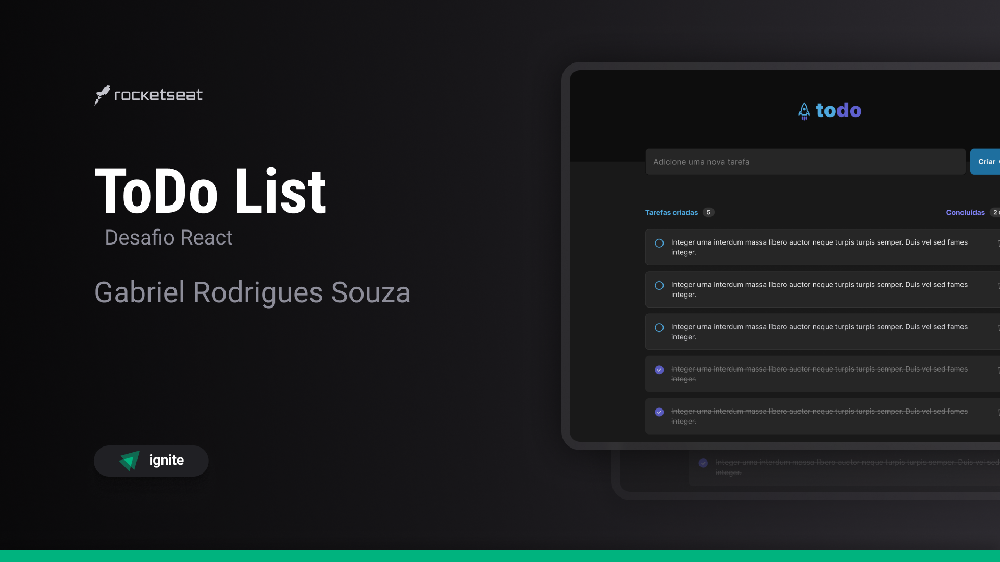

<h1 align="center"> ToDo List </h1>

Desafio de conclusão do cápitulo 1 do modulo Fundamentos da certificação Ignite-Rocketseat.

  <a href="#-tecnologias">Tecnologias</a>&nbsp;&nbsp;&nbsp;|&nbsp;&nbsp;&nbsp;
  <a href="#-projeto">Projeto</a>&nbsp;&nbsp;&nbsp;|&nbsp;&nbsp;&nbsp;
  <a href="#-layout">Layout</a>&nbsp;&nbsp;&nbsp;|&nbsp;&nbsp;&nbsp;
  <a href="#memo-licença">Licença</a>

  

 

  

## 🚀 Tecnologias

Esse projeto foi desenvolvido com as seguintes tecnologias:

- [ReactJS](https://https://react.dev/)
- [Typescript](https://www.typescriptlang.org/)
- [Vite](https://vitejs.dev/)
- CSS Module

## 💻 Projeto

O ToDo List é uma página web para criação e controle de tarefas.

## 🔖 Layout

Você pode visualizar o layout do projeto através [DESSE LINK](https://www.figma.com/design/X1nuokS8lfyMzEkrqB6hPZ/ToDo-List-%E2%80%A2-Desafio-React-(My)?node-id=4130-112&t=aEL2SUKZjALMxjip-0/duplicate). É necessário ter conta no [Figma](https://figma.com) para acessá-lo.

## :memo: Licença

Esse projeto está sob a licença MIT.

---

Feito com ♥ por mim junto com a Rocketseat
